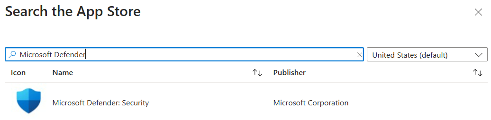
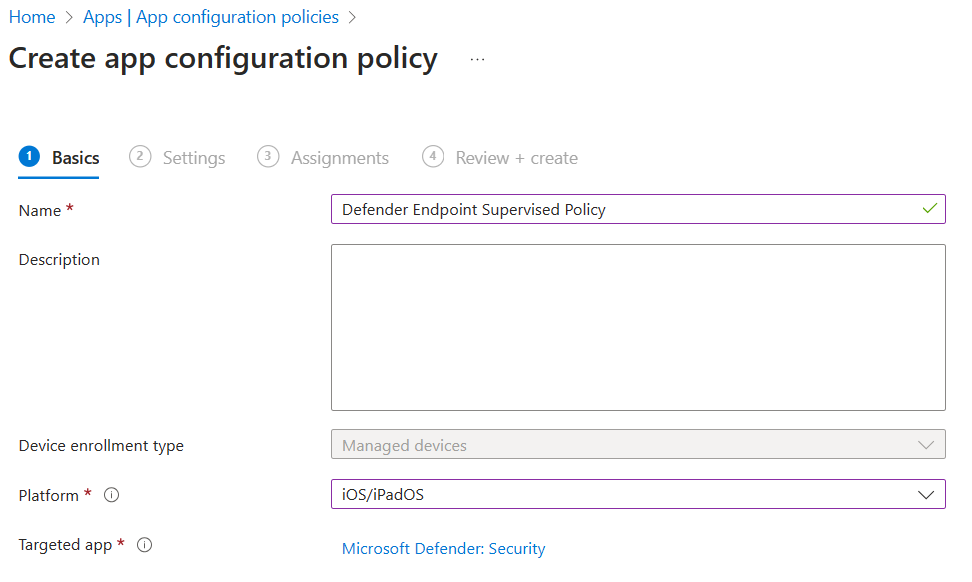
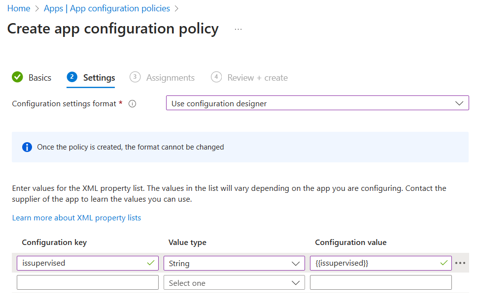
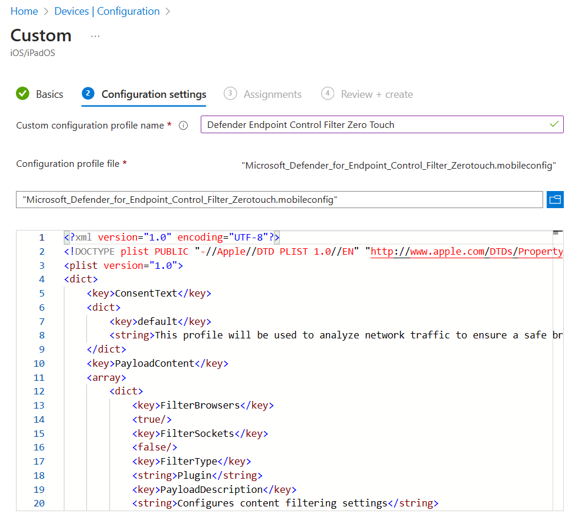

## Prerequisites

- Intune and Defender correctly set up. See [Fresh Tenant Setup](./Fresh%2520Tenant%2520Setup.md#) for how to prepare a test tenant. 
- Test devices. You'll want at least 2 iOS devices to compare unsupervised vs supervised on iOS.

The deployment and configuration varies based on if the iOS devices are supervised or unsupervised.

## Deploy Defender Endpoint App to iOS devices
[:link: Portal](https://intune.microsoft.com/#view/Microsoft_Intune_DeviceSettings/AppsIosMenu/~/iosApps)  
[:blue_book: Docs](https://learn.microsoft.com/en-us/microsoft-365/security/defender-endpoint/ios-install?view=o365-worldwide#deployment-steps-applicable-for-both-supervised-and-unsupervised-devices)

*Applies to: Supervised and unsupervised devices*

1. Add the iOS store app for Microsoft Defender, target all users you want to have Defender for Endpoint. As of writing, the name in the App Store is Microsoft Defender: Security.
   

## Configure Defender for Endpoint

### App Supervision Policy
[:link: Portal](https://intune.microsoft.com/#view/Microsoft_Intune_DeviceSettings/AppsMenu/~/appConfig)  
[:blue_book: Docs](https://learn.microsoft.com/en-us/microsoft-365/security/defender-endpoint/ios-install?view=o365-worldwide#configure-supervised-mode-via-microsoft-intune)

*Applies to: Supervised and unsupervised devices*

This is confusing in the docs, but because it uses a token that will be resolved on the device, you can safely deploy this policy to both supervised and unsupervised devices.

1. Create an app configuration policy for Managed Devices for platform iOS and targeted app Microsoft Defender: Security
   
2. Use the configuration designer to set a string key/value pair
   Key: `issupervised`  
   Type: `string`  
   Value: `{{issupervised}}`  
   
3. Target both supervised and unsupervised devices. 

### Onboarding Profiles
[:link: Portal](https://intune.microsoft.com/#view/Microsoft_Intune_DeviceSettings/AppsMenu/~/appConfig)  
[:blue_book: Docs](https://learn.microsoft.com/en-us/microsoft-365/security/defender-endpoint/ios-install?view=o365-worldwide#automated-onboarding-setup-only-for-unsupervised-devices)

*Applies to:  Unsupervised devices

For unsupervised devices, there are two ways to finalize the configuration of Defender for Endpoint after its been deployed.

**Zero-Touch onboarding:** This automatically configures Defender for Endpoint without any user interaction. Recommended.  
**Simplified onboarding:** This requires users to [open Defender to finalize onboarding](https://learn.microsoft.com/en-us/microsoft-365/security/defender-endpoint/ios-install?view=o365-worldwide#complete-onboarding-and-check-status) *before* the VPN functions.

1. Create an device configuration policy for iOS/iPadOS devices with the template type VPN with the following settings
   Connection Name = `Microsoft Defender for Endpoint`  
   VPN server address = `127.0.0.1`  
   Auth method = `Username and password`  
   Split Tunneling = `Disable`  
   VPN identifier = `com.microsoft.scmx`  
   For Zero-Touch onboarding:  
   Key/Value Pairs:  
      Key: `SilentOnboard`  
      Value: `True`  
  For Simplified onboarding:  
  Key/Value Pairs:  
      Key: `AutoOnboard`  
      Value: `True`  
   Type of Automatic VPN = On-demand VPN  
   Add a on-demand rule:  
      I want to do the following:  `Connect VPN`  
      I want to restrict to: `All domains`  
2. To prevent users from disabling the VPN in iOS Settings, set  
   Block users from disabling automatic VPN: `Yes`  
3. To disable the On/Off Toggle for the VPN in the Defender app itself, add the following key/value pair:  
   Key: `EnableVPNToggleInApp`  
   Value: `TRUE`  
4. Target unsupervised devices

### Control Filter
[:link: Portal](https://intune.microsoft.com/#view/Microsoft_Intune_DeviceSettings/DevicesMenu/~/configuration)  
[:blue_book: Docs](https://learn.microsoft.com/en-us/microsoft-365/security/defender-endpoint/ios-install?view=o365-worldwide#device-configuration-profile-control-filter)

*Applies to:  Supervised devices*

The Control Filter allows Defender for Endpoint's Web Protection **without** the loopback VPN whatsoever. This does not work with other always-on VPNs.

1. Create a Device Config profile with the following settings:  
   Platform: `iOS/iPadOS`  
   Profile Type: `Templates`  
   Template Name: `Custom`  
2. Download the [ControlFilterZeroTouch .mobileconfig profile](https://aka.ms/mdeiosprofilesupervisedzerotouch) and upload it.
   
3. Target supervised devices. If you accidently target unsupervised it won't apply on those.

