These are the steps I typically take to set up a fresh M365 E5 tenant. This is not complete. I'm documenting this (finally) as I rebuild a new test tenant.

## Entra ID

### Azure AD Connect

Assuming you already have a Lab Domain Controller and Server for AAD Connect.

Install AAD Connect, use Express Settings


After it is finished, re-run and enable Hybrid Join


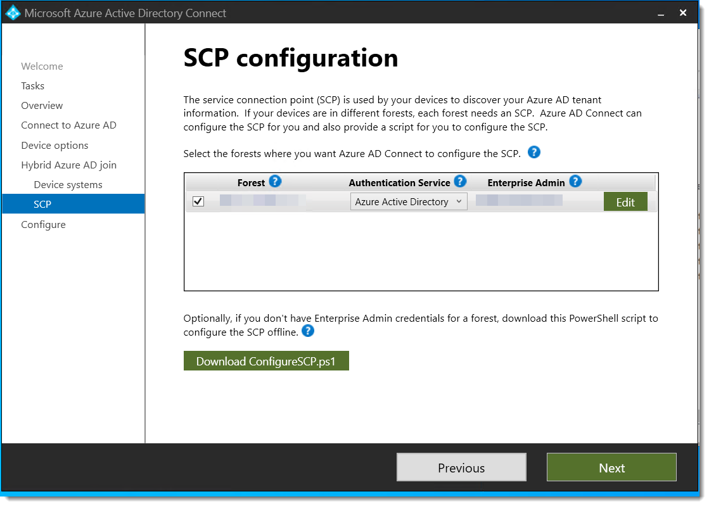

### Enable Group Writeback
[:blue_book: Docs](https://learn.microsoft.com/en-us/azure/active-directory/hybrid/connect/how-to-connect-group-writeback-enable)

On the AzureAD Connect server, run the following commands to enable Group Writeback in Windows PowerShell
``` PowerShell
Set-ADSyncScheduler -SyncCycleEnabled $false
Set-ADSyncAADCompanyFeature -GroupWritebackV2 $true
Set-ADSyncScheduler -SyncCycleEnabled $true
Start-ADSyncSyncCycle -PolicyType Initial
```

### Hybrid Cloud Trust
[:blue_book: Docs](https://docs.microsoft.com/en-us/azure/active-directory/authentication/howto-authentication-passwordless-security-key-on-premises#example-4-prompt-for-cloud-credentials-using-modern-authentication)

Create EntraID Kerberos Server

``` powershell
# Specify the on-premises Active Directory domain. A new Azure AD
# Kerberos Server object will be created in this Active Directory domain.
$domain = "contoso.com"

# Enter a UPN of an Azure Active Directory global administrator
$userPrincipalName = "admin@contoso.com"

# Enter a domain administrator username and password.
$domainCred = Get-Credential

# Create the new Azure AD Kerberos Server object in Active Directory
# and then publish it to Azure Active Directory.
# Open an interactive sign-in prompt with given username to access the Azure AD.
Set-AzureADKerberosServer -Domain $domain -UserPrincipalName $userPrincipalName -DomainCredential $domainCred

# Verify server
Get-AzureADKerberosServer -Domain $domain -DomainCredential $domainCred -UserPrincipalName $userPrincipalName

Id                 : 17530
UserAccount        : CN=krbtgt_AzureAD,CN=Users,DC=contoso,DC=com
ComputerAccount    : CN=AzureADKerberos,OU=Domain Controllers,DC=contoso,DC=com
DisplayName        : krbtgt_17530
DomainDnsName      : contoso.com
KeyVersion         : 27591
KeyUpdatedOn       : 10/13/2022 9:23:43 PM
KeyUpdatedFrom     : CONTOSO-DC-01.contoso.com
CloudDisplayName   : krbtgt_17530
CloudDomainDnsName : contoso.com
CloudId            : 17530
CloudKeyVersion    : 27591
CloudKeyUpdatedOn  : 10/13/2022 9:23:43 PM
CloudTrustDisplay  :
```


## Entra
### Identity Protection

#### Self Service Password Reset
[:link: Portal]  
[:blue_book: Docs](https://learn.microsoft.com/en-us/entra/identity/authentication/howto-sspr-deployment)

- Enable Self service password reset
	- Target a group that excludes service accounts. 

#### Authentication Methods
[:link: Portal](https://entra.microsoft.com/#view/Microsoft_AAD_IAM/AuthenticationMethodsMenuBlade/~/AdminAuthMethods)  
[:blue_book: Docs](https://learn.microsoft.com/en-us/entra/identity/authentication/concept-authentication-methods)

- Enable FIDO2, Authenticator, Temporary Access Pass in Authentication Methods
- Disable verification options in the [legacy MFA settings portal](https://account.activedirectory.windowsazure.com/usermanagement/mfasettings.aspx)
  
- Disable Authentication methods in [SSPR Authentication Methods](https://entra.microsoft.com/#view/Microsoft_AAD_IAM/PasswordResetMenuBlade/~/AuthenticationMethods/fromNav/Identity)
  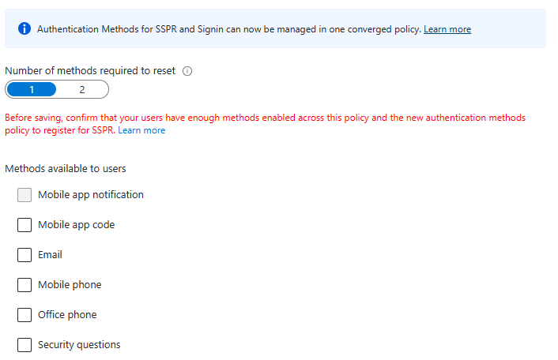
- Migrate to the [Converged Authentication Methods Policy](https://entra.microsoft.com/#view/Microsoft_AAD_IAM/AuthenticationMethodsMenuBlade/~/AdminAuthMethods)
  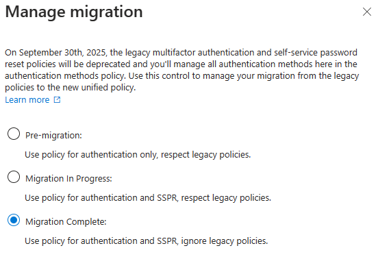 

### User Settings
[:link: Portal](https://entra.microsoft.com/#view/Microsoft_AAD_UsersAndTenants/UserManagementMenuBlade/~/UserSettings/menuId/)

- Toggle Off
	- Users can register Applications
	- Show keep user signed in
- Toggle On
	- Restrict non-admin users from creating tenants
	- Restrict access to Entra ID administration portal
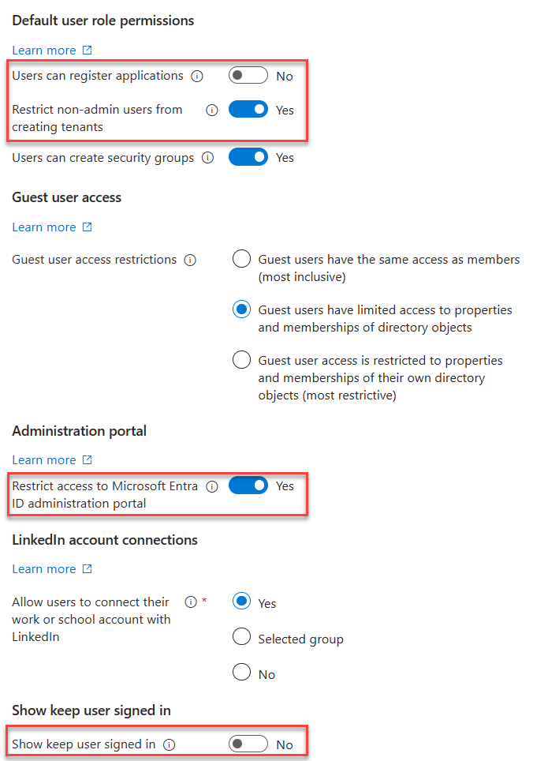

### User Feature Settings
[:link: Portal](https://entra.microsoft.com/#view/Microsoft_AAD_IAM/FeatureSettingsBlade)

- Select All for Users can use preview features for My Apps

### Device Settings

#### Cloud LAPS
[:link: Portal](https://portal.azure.com/#view/Microsoft_AAD_Devices/DevicesMenuBlade/~/DeviceSettings/menuId~/null)  
[:blue_book: Docs](https://learn.microsoft.com/en-us/mem/intune/protect/windows-laps-overview)

- Enable LAPS
  

#### Enterprise State Roaming
[:link: Portal](https://portal.azure.com/#view/Microsoft_AAD_Devices/DevicesMenuBlade/~/RoamingSettings/menuId~/null)

- Enable Enterprise State Roaming
  

### Identity Protection

#### Multifactor authentication registration policy

- Create a AAD group called Service Accounts, add the AzureAD Connect sync account
- Enable the policy, targeting all users and excluding 

### Diagnostic Settings
[:link: Portal](https://portal.azure.com/#view/Microsoft_AAD_IAM/ActiveDirectoryMenuBlade/~/DiagnosticSettings)  
[:blue_book: Docs](https://learn.microsoft.com/en-us/azure/azure-monitor/essentials/diagnostic-settings)

- Enable all diagnostic settings to log to your Sentinel's log analytics workspace
  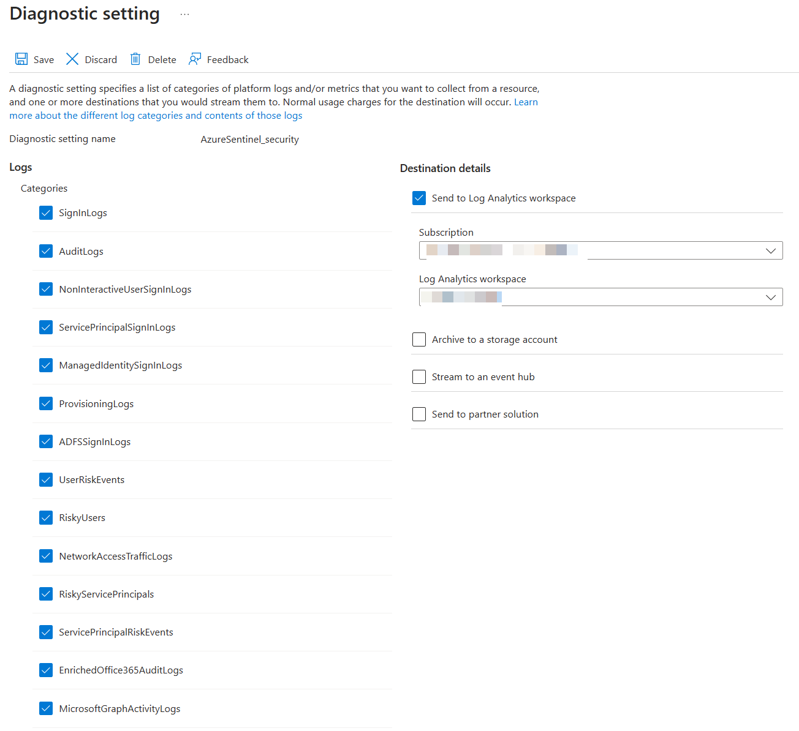
  
### Global Secure Access
[:link: Portal](https://entra.microsoft.com/#view/Microsoft_Azure_Network_Access/Welcome.ReactView)  
[:blue_book: Docs](https://learn.microsoft.com/en-us/entra/global-secure-access/)

#### Internet Access
1. Enable the [M365 Profile](https://entra.microsoft.com/#view/Microsoft_Azure_Network_Access/ForwardingProfile.ReactView)
   
2. Download the [GSA Client](https://entra.microsoft.com/#view/Microsoft_Azure_Network_Access/Clients.ReactView) and deploy to Windows devices.


## Intune

### Tenant Administration Settings

#### Defender for Endpoint Connector
[:link: Portal](https://intune.microsoft.com/#view/Microsoft_Intune_DeviceSettings/TenantAdminConnectorsMenu/~/windowsDefenderATP)

- Enable compliance policy evaluation for all platforms
- Enable app sync
- Enable App protection policy evaluation


### Devices

#### Windows Automatic Enrollment
[:link: Portal](https://intune.microsoft.com/#view/Microsoft_Intune_DeviceSettings/DevicesWindowsMenu/~/windowsEnrollment)

- Set MDM and MAM user scopes to all
  

#### Windows Autopilot
[:link: Portal](https://intune.microsoft.com/#view/Microsoft_Intune_Enrollment/AutopilotDeploymentProfiles.ReactView)

- Create a new Autopilot deployment profile
  

#### iOS Enrollment
[:link: Portal](https://intune.microsoft.com/#view/Microsoft_Intune_DeviceSettings/DevicesIosMenu/~/iosEnrollment)

User-driven iOS enrollment is a two step process - the push certificate and the enrollment profile.

##### Configure Apple MDM Push Certificate
[:blue_book: Docs](https://learn.microsoft.com/en-us/mem/intune/enrollment/apple-mdm-push-certificate-get)


##### Enrollment Profile
[:link: Portal](https://intune.microsoft.com/#view/Microsoft_Intune_Enrollment/UserInitiatedEnrollmentProfilesListBlade)

- Configure an enrollment profile
	- Create a profile that allows user choice of type of device (corporate vs user), target all users.
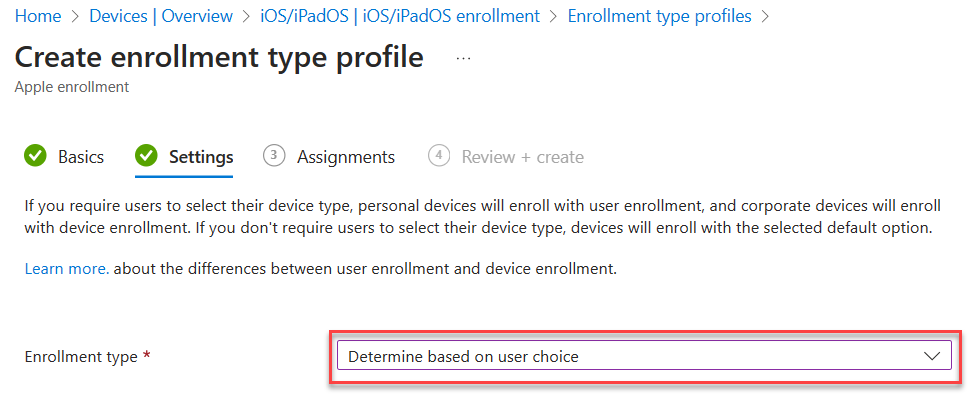

##### Supervised iOS Enrollment with Apple Configurator
[:link: Portal](https://intune.microsoft.com/#view/Microsoft_Intune_Enrollment/AppleConfiguratorMenuBlade/~/profiles)  
[:blue_book: Docs](https://learn.microsoft.com/en-us/mem/intune/enrollment/apple-configurator-enroll-ios)
There are two options for Apple Config profile - with user affinity and without. For testing, enrollment with User Affinity with the Company Portal app mimics how devices might be distributed to end users.
1. Create a new Enrollment Profile. On the settings step, select:
   User affinity: `Enroll with User Affinity`
   Select where users must authenticate: `Company Portal`
2. Export the profile you just created. Copy the URL.
   
3. Create a csv file with the serial numbers of iPads you wish to enroll.
   `Serial number,device details`
4. Upload the csv file in the portal under [Devices](https://intune.microsoft.com/#view/Microsoft_Intune_Enrollment/AppleConfiguratorMenuBlade/~/devices). Assign the profile you just created.
   
5. In Apple Configurator, choose Settings -> Servers. Click + to add a server. Add the URL you copied from step 2.
   
6. Connect a device, and at the main screen, click Prepare. Leave the default options unchanged.
   
7. Choose the Intune MDM server defined in Step 5.
   
8. Skip Apple Business Manager sign-in if prompted. At the Organization screen select a previous org or create a new one. This is shown in the settings app in iOS.
9. Choose to generate a new supervision Identity or reuse an existing one.
10. Choose which steps to display in the Setup Assistant. Click Prepare to start the process.
#### Android Enrollment
[:link:Portal](https://intune.microsoft.com/#view/Microsoft_Intune_DeviceSettings/DevicesAndroidMenu/~/androidEnrollment)  
[:blue_book:Docs](https://learn.microsoft.com/en-us/mem/intune/fundamentals/deployment-guide-enrollment-android#enable-enrollment-of-android-for-work-devices)

User-driven Android enrollment is a two step process - the managed Google Play account linking  and the enrollment profile.

##### Managed Google Play Account Linking

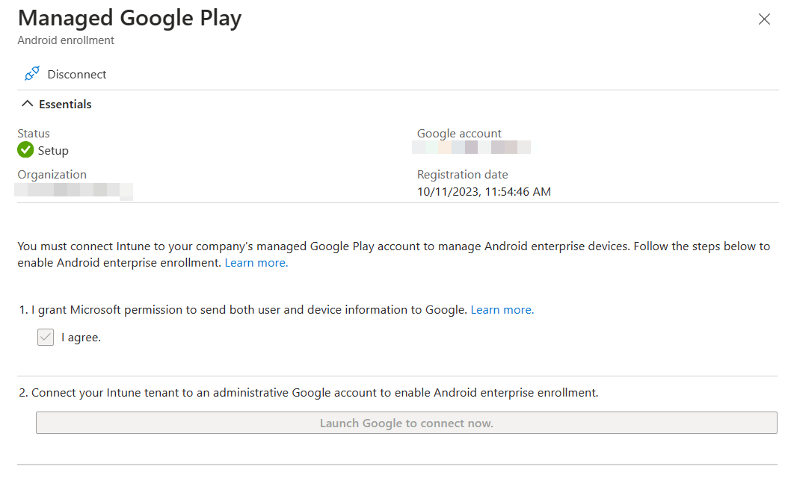
### Applications
[:link:Portal](https://endpoint.microsoft.com/#view/Microsoft_Intune_DeviceSettings/AppsMenu/~/overview)  
[:blue_book: Docs](https://learn.microsoft.com/en-us/mem/intune/apps/apps-add)

#### Windows
Add app -> Microsoft 365 Apps for Windows 10 and Later. Assign to all devices.


### Endpoint security
[:link:Portal](https://endpoint.microsoft.com/#view/Microsoft_Intune_Workflows/SecurityManagementMenu/~/overview)

##### Windows
Under Endpoint Detection and Response, create a new policy targeting Windows 10,11 and Server. Target all devices.


#### MacOS
Deploying MDE on MacOS is a multi-step manual process, and changes occasionally. Refer to [Intune-based deployment for Microsoft Defender for Endpoint on Mac - Microsoft Defender for Endpoint | Microsoft Learn](https://learn.microsoft.com/en-us/defender-endpoint/mac-install-with-intune) for the most current steps.

The config files for MDE on Mac and Linux are in [this GitHub repo](https://github.com/microsoft/mdatp-xplat/tree/master).

1. Approve system extensions
2. Deploy the [combined mobileconfig file from the repo](https://github.com/microsoft/mdatp-xplat/blob/master/macos/mobileconfig/combined/mdatp.mobileconfig) to simplify policies.
3. Deploy the [Microsoft AutoUpdate config file from the repo](https://github.com/microsoft/mdatp-xplat/blob/master/macos/settings/microsoft_auto_update/com.microsoft.autoupdate2.mobileconfig)
4. Deploy the [MDE Preferences config file from the repo](https://github.com/microsoft/mdatp-xplat/blob/master/macos/settings/data_loss_prevention/com.microsoft.wdav.mobileconfig) to enable Endpoint DLP.
5. Deploy the [Defender App via Intune](https://learn.microsoft.com/en-us/defender-endpoint/mac-install-with-intune#step-14-publish-application)
6. Deploy the [MDE onboarding package](https://learn.microsoft.com/en-us/defender-endpoint/mac-install-with-intune#step-15-download-the-onboarding-package)


#### [Security Baselines](https://endpoint.microsoft.com/#view/Microsoft_Intune_Workflows/SecurityManagementMenu/~/securityBaselines)

Create a new Microsoft Defender for Endpoint Baseline policy and target all devices.


#### [Account Protection](https://endpoint.microsoft.com/#view/Microsoft_Intune_Workflows/SecurityManagementMenu/~/accountprotection)

After enabling LAPS in Entra, create a Windows LAPS profile and apply to all devices.


## [M365 Defender](https://security.microsoft.com/)

### Email & collaboration

[Policies & Rules -> Threat Policies -> Preset Security Configurations](https://security.microsoft.com/presetSecurityPolicies)

Enable Standard Protection Preset Policies.


### MDCA
In the Defender Portal, go to [Settings -> Cloud Apps](https://security.microsoft.com/cloudapps/settings?tabid=about)

#### System
##### [Preview Features](https://security.microsoft.com/cloudapps/settings?tabid=previewFeatures)
- Toggle Enable
##### [IP address Ranges](https://security.microsoft.com/cloudapps/settings?tabid=ipRanges)
- If you have IP Ranges as Trusted Named Locations in EID, add them as Custom IP Address Ranges in MDCA with the category of Corporate
  


#### Cloud Discovery

##### [Defender for Endpoint](https://security.microsoft.com/cloudapps/settings?tabid=app-control)
- Enforce App Access with Defender for Endpoint
  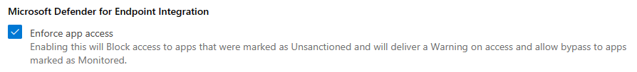

##### [User Enrichment](https://security.microsoft.com/cloudapps/settings?tabid=discovery-userEnrichment)
- Enable User Enrichment   

#### Information Protection

##### [Microsoft Information Protection](https://security.microsoft.com/cloudapps/settings?tabid=security)
- Enable automatically scan new files
- Enable scanning protected files. You'll need to go through the OAUTH grant process.
  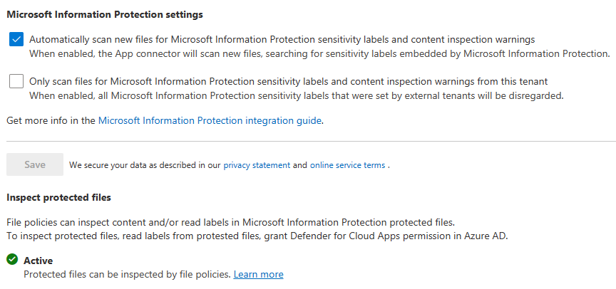

##### [Files](https://security.microsoft.com/cloudapps/settings?tabid=files)
- Enable file monitoring
  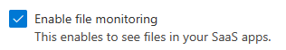

#### App governance

##### [Service Status](https://security.microsoft.com/cloudapps/settings?tabid=activateAppG)
- Turn on app governance
  

#### Connected Apps

##### [App Connectors](https://security.microsoft.com/cloudapps/settings?tabid=appConnectors)
- Hit Connect an app, choose Microsoft 365 from the list. Select all options.


#### [SIEM Agents](https://security.microsoft.com/cloudapps/settings?tabid=siemAgents)

- Add the Azure Sentinel integration
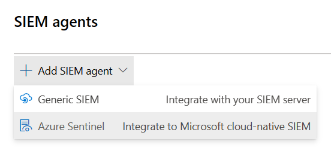

### MDE
In the Defender Portal, go to [Settings -> Endpoints](https://security.microsoft.com/securitysettings/endpoints/integration)

#### Advanced Features
Set the features configured below


### Defender for Identity (MDI)

#### General
In the Defender Portal, go to [Settings -> Identities](https://security.microsoft.com/settings/identities)

##### Sensors
Click +Add Sensor, and download the installer and copy the Access key


Install the sensor on all DCs in AD. Use the access key when prompted by the installer.


After installing, configure the Active Directory requirements listed below.

#### AD Configuration

- [Configure Event Collection via GPO](https://learn.microsoft.com/en-us/defender-for-identity/configure-windows-event-collection)
- Configure Group Managed Service Account account
	- On the first DC
		- Create root KDS key
		  ``` powershell
		 Add-KdsRootKey -EffectiveTime ((get-date).addhours(-10))
		 ```
		- Purge kerberos tickets
		  ``` powershell
		  klist purge -li 0x3e7
```
		- Create the gMSA
		  ``` powershell
		 New-ADServiceAccount accountname -PrincipalsAllowedToRetrieveManagedPassword "Domain Controllers" -DNSHostName accountname.domain.contoso.com
```
		- Install the gMSA on the DC
		  ``` powershell
		  Install-ADServiceAccount -Identity 'accountname'
```
	- On the other DCs, purge kerberos tickets and install the service account
	- Add the gMSA in the portal
	  


## Microsoft Purview

### Device Onboarding
[:book:Windows](https://learn.microsoft.com/en-us/purview/device-onboarding-overview)  
[:book:Mac](https://learn.microsoft.com/en-us/purview/device-onboarding-macos-overview)  
[:link:](https://compliance.microsoft.com/compliancesettings/deviceonboarding)

1. Enable Windows and Mac device onboarding. This requires MDE.

### Sensitivity Labels

#### Enable labeling for Protected content & PDFs
- [Enable Sensitivity Labels for Protected Content](https://learn.microsoft.com/en-us/purview/sensitivity-labels-sharepoint-onedrive-files#use-the-microsoft-purview-compliance-portal-to-enable-support-for-sensitivity-labels)
- [Enable labeling support for PDFs](https://learn.microsoft.com/en-us/purview/sensitivity-labels-sharepoint-onedrive-files#adding-support-for-pdf)

With the [SharePoint Module](https://www.powershellgallery.com/packages/Microsoft.Online.SharePoint.PowerShell) in PowerShell 5

```powershell
connect-sposervice -url 'https://<tenant>-admin.sharepoint.com/'
Set-SPOTenant -EnableAIPIntegration $true
Set-SPOTenant -EnableSensitivityLabelforPDF $true
```

#### Enable Labeling for Containers
In a fresh tenant, there will not be any EntraID group settings configured, so those [need to be created](https://learn.microsoft.com/en-us/azure/active-directory/enterprise-users/groups-settings-cmdlets). After that, you can [enable the label sync](https://learn.microsoft.com/en-us/purview/sensitivity-labels-teams-groups-sites#how-to-enable-sensitivity-labels-for-containers-and-synchronize-labels).

With the [AzureADPreview module](https://www.powershellgallery.com/packages/AzureADPreview) in Windows PowerShell (PS5)

```PowerShell
Connect-AzureAd
$TemplateId = (Get-AzureADDirectorySettingTemplate | where { $_.DisplayName -eq "Group.Unified" }).Id
$Template = Get-AzureADDirectorySettingTemplate | where -Property Id -Value $TemplateId -EQ
$setting = $Template.CreateDirectorySetting()
$setting["EnableMIPLabels"] = "True"
New-AzureADDirectorySetting -DirectorySetting $Setting
```

Then, with the [ExchangeOnlineManagement module](https://www.powershellgallery.com/packages/ExchangeOnlineManagement) in PS5/PS7+

```PowerShell
Connect-IPPSSession
Execute-AzureAdLabelSync
```

#### Enable co-authoring for Encrypted Files
This can be [done in the portal](https://learn.microsoft.com/en-us/purview/sensitivity-labels-coauthoring#how-to-enable-co-authoring-for-files-with-sensitivity-labels), or via PowerShell.

With the [ExchangeOnlineManagement module](https://www.powershellgallery.com/packages/ExchangeOnlineManagement) in PS5/PS7+

```PowerShell
Connect-IPPSSession
Set-PolicyConfig -EnableLabelCoauth:$true
```

### DLP

#### Endpoint DLP

##### Settings
[:link: Portal](https://compliance.microsoft.com/datalossprevention/endpointdlpsettings)
[:blue_book: Docs](https://learn.microsoft.com/en-us/purview/dlp-configure-endpoint-settings)

In Settings, change the following:
- Advanced classification scanning and protection: `On`

### MIP Scanner
[:link: Portal](https://compliance.microsoft.com/compliancesettings/scanner_onboarding)
[:blue_book: Docs](https://learn.microsoft.com/en-us/purview/deploy-scanner)

Prerequisites
- Service account in AD, exclude from MFA registration and CAs
- SQL server for the scanner, as well as a windows server.

Deployment
1. Create a Scanner Cluster
   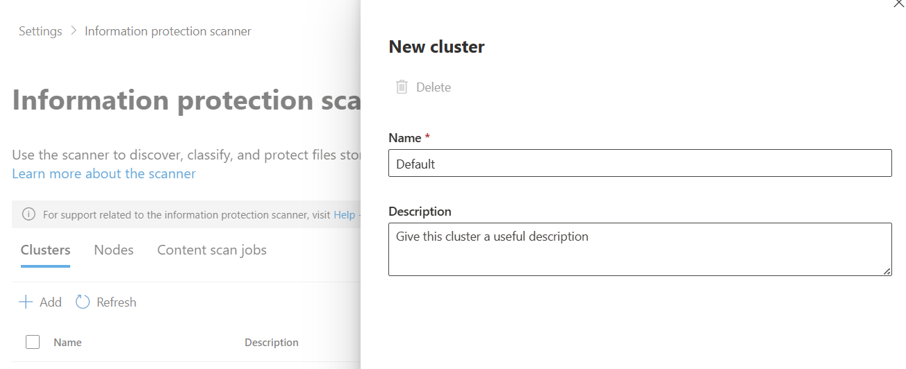
2. Create a Content Scan Job. Be sure to disable any of the auto options - this will just be for scanning.
   


#### Exact Data Match
[:link: Portal](https://compliance.microsoft.com/insiderriskmgmt?viewid=policies)  
[:blue_book: Docs](https://learn.microsoft.com/en-us/purview/insider-risk-management-policies)

##### EDM SIT
1. Create a new EDM SIT. Since I work in healthcare, I typically use [Synthea](https://github.com/synthetichealth/synthea) to generate patient records. We do have [sample industry files](https://learn.microsoft.com/en-us/purview/sit-get-started-exact-data-match-export-data#sample-file-templates) you can use. 
2. Make note of the datastrore name when you finish the EDM wizard. You'll need it for the EDM uploader.

##### EDM Uploader Tool
1. Create a service account for the EDM upload agents to run as.
2. Create a EntraID security group named `EDM_DataUploaders` and add the service account to it.
3. Install the EDM upload tool to `c:\EDM`
4. Place sample data in `c:\EDM\Data`
5. Save the schema `.\EdmUploadAgent.exe /SaveSchema /DataStoreName your_data_store_name /OutputDir c:\edm\data`
6. Create `c:\EDM\hash`
7. Upload the data `.\EdmUploadAgent.exe /uploaddata /datastorename your_data_store_name /datafile C:\edm\data\your_data.csv /hashlocation c:\edm\hash /schema C:\edm\data\your_data_store_name.xml /allowedbadlinespercentage 5`


### Insider Risk Management

#### Roles
[:link: Portal](https://compliance.microsoft.com/compliancecenterpermissions)  
[:blue_book: Docs](https://learn.microsoft.com/en-us/purview/insider-risk-management-configure#step-1-required-enable-permissions-for-insider-risk-management)  

Add your account to the `Insider Risk Management` role. 
#### Browser Activity Plugins
1. Deploy the Edge profile via Intune as described [here](https://learn.microsoft.com/en-us/purview/insider-risk-management-browser-support#option-2-intune-setup-for-edge)
2. Deploy the Chrome profile via Intune as described [here](https://learn.microsoft.com/en-us/purview/insider-risk-management-browser-support#option-2-intune-setup-for-chrome)

#### Settings
[:link: Portal](https://compliance.microsoft.com/insiderriskmgmt/globalsettings?viewid=overview)  
[:blue_book: Docs](https://learn.microsoft.com/en-us/purview/insider-risk-management-settings)

##### Policy Indicators
- Select all indicators under the following categories
	- Office
	- Device
	- Microsoft Defender for Endpoint
	- Risky Browsing
	- Microsoft Defender for Cloud Apps

##### Analytics
- Toggle analytics on

#### Polices
[:link: Portal](https://compliance.microsoft.com/insiderriskmgmt?viewid=policies)  
[:blue_book: Docs](https://learn.microsoft.com/en-us/purview/insider-risk-management-policies)

1. Create a Data Leaks policy from the template
   
2. Target all users
3. Choose not to prioritize content.
   
4. For triggering events, choose `User performs an exfiltration activity`
5. For thresholds, choose `Apply built-in thresholds.`
6. For indicators, leave the default ones checked.