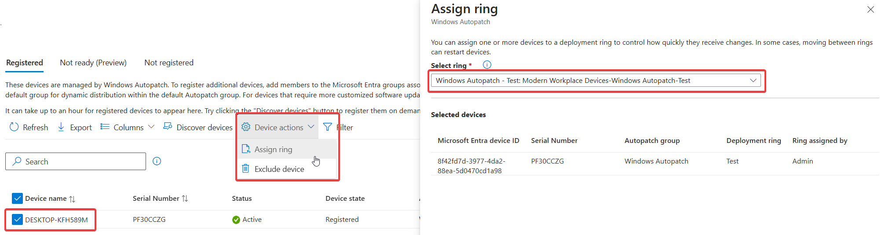
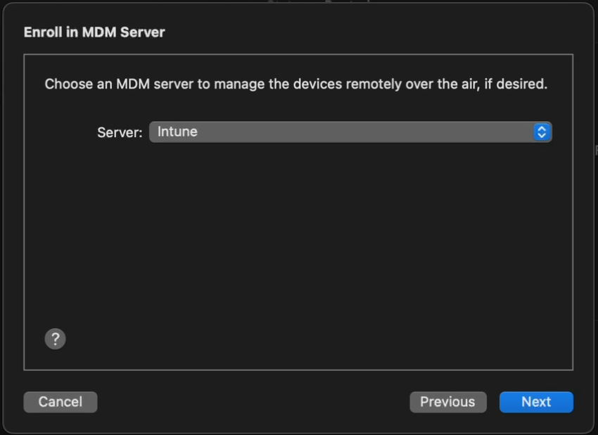
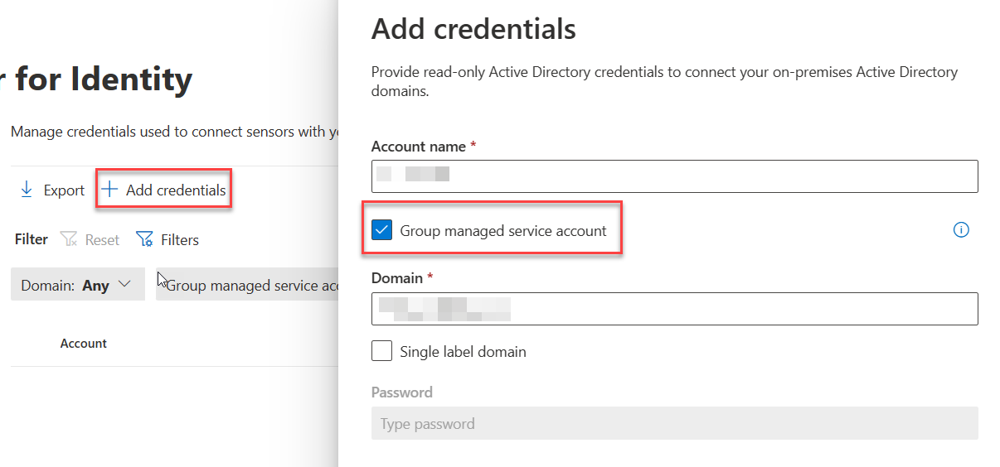

These are the steps I typically take to set up a fresh M365 E5 tenant.


> [!INFO] Work in Progress
> This is very much a continuous work in progress. I publish changes as I go. Screenshots might be out of date.


!!! info "Work in Progress"
    This is very much a continuous work in progress. I publish changes as I go. Screenshots might be out of date.

!!! warning "Use at your own risk"
     These are my personal steps. This should not be construed as official guidance. Always refer to the official Microsoft documentation available at [learn.microsoft.com](https://learn.microsoft.com/)

## Entra

### Entra Cloud Sync

[:link: Portal](https://entra.microsoft.com/#view/Microsoft_AAD_Connect_Provisioning/AADConnectMenuBlade/~/GetStarted)  [:blue_book: Docs](https://learn.microsoft.com/en-us/entra/identity/hybrid/cloud-sync/tutorial-single-forest)

Cloud Sync is the lightweight replacement for AAD Connect. Follow the instructions in the Docs link for a step-by-step example for a single forest install.

For conditional access, be sure to exclude the Directory Synchronization Accounts role from any MFA policies.

### Hybrid Cloud Trust

[:blue_book: Docs](https://docs.microsoft.com/en-us/azure/active-directory/authentication/howto-authentication-passwordless-security-key-on-premises#example-4-prompt-for-cloud-credentials-using-modern-authentication)

Create EntraID Kerberos Server

``` powershell
# Install the AzureADHybridAuthenticationManagement module
Install-Module -Name AzureADHybridAuthenticationManagement -AllowClobber

# Specify the on-premises Active Directory domain. A new Azure AD
# Kerberos Server object will be created in this Active Directory domain.
$domain = "contoso.com"

# Enter a UPN of an Azure Active Directory global administrator
$userPrincipalName = "admin@contoso.com"

# Enter a domain administrator username and password.
$domainCred = Get-Credential

# Create the new Azure AD Kerberos Server object in Active Directory
# and then publish it to Azure Active Directory.
# Open an interactive sign-in prompt with given username to access the Azure AD.
Set-AzureADKerberosServer -Domain $domain -UserPrincipalName $userPrincipalName -DomainCredential $domainCred

# Verify server
Get-AzureADKerberosServer -Domain $domain -DomainCredential $domainCred -UserPrincipalName $userPrincipalName

Id                 : 17530
UserAccount        : CN=krbtgt_AzureAD,CN=Users,DC=contoso,DC=com
ComputerAccount    : CN=AzureADKerberos,OU=Domain Controllers,DC=contoso,DC=com
DisplayName        : krbtgt_17530
DomainDnsName      : contoso.com
KeyVersion         : 27591
KeyUpdatedOn       : 10/13/2022 9:23:43 PM
KeyUpdatedFrom     : CONTOSO-DC-01.contoso.com
CloudDisplayName   : krbtgt_17530
CloudDomainDnsName : contoso.com
CloudId            : 17530
CloudKeyVersion    : 27591
CloudKeyUpdatedOn  : 10/13/2022 9:23:43 PM
CloudTrustDisplay  :
```

### Device Settings

[:link: Portal](https://entra.microsoft.com/#view/Microsoft_AAD_Devices/DevicesMenuBlade/~/DeviceSettings/menuId/Overview)

- Disable adding GA to local admin.  
    

### App Registrations

#### MS Graph PowerShell SDK

To enable use of the [MS Graph PowerShell SDK](https://learn.microsoft.com/en-us/powershell/microsoftgraph/?view=graph-powershell-1.0), create an app registration for app-only for use with the SDK.

[:link: Portal](https://entra.microsoft.com/#view/Microsoft_AAD_RegisteredApps/ApplicationsListBlade/quickStartType~/null/sourceType/Microsoft_AAD_IAM)

1. Create the app registration.  
   
2. Grant application permissions for Microsoft Graph that are necessary for your use cases.
3. I prefer to do app consent cert-based authentication. Here's a couple of links explaining the process:
    1. [How to use Connect-MgGraph - All Options — LazyAdmin](https://lazyadmin.nl/powershell/connect-mggraph/#certificate-based)
    2. [Use app-only authentication with the Microsoft Graph PowerShell SDK | Microsoft Learn](https://learn.microsoft.com/en-us/powershell/microsoftgraph/app-only?view=graph-powershell-1.0)

### Identity Protection

#### Self Service Password Reset

[:link: Portal](https://entra.microsoft.com/#view/Microsoft_AAD_IAM/PasswordResetMenuBlade/~/Properties/fromNav/)  [:blue_book: Docs](https://learn.microsoft.com/en-us/entra/identity/authentication/howto-sspr-deployment)

- Enable Self service password reset
  - Target a group that excludes service accounts. Easiest way to do this is with a dynamic group. Example rule: `(user.displayName -ne "On-Premises Directory Synchronization Service Account") and (user.userPrincipalName -notStartsWith "svc")`
- Enable Password writeback in On-premises integration  
    

#### Authentication Methods

[:link: Portal](https://entra.microsoft.com/#view/Microsoft_AAD_IAM/AuthenticationMethodsMenuBlade/~/AdminAuthMethods)  [:blue_book: Docs](https://learn.microsoft.com/en-us/entra/identity/authentication/concept-authentication-methods)

##### Policies

For methods, enable

- Passkeys
- Authenticator  
    
- Enable FIDO2, Authenticator, Temporary Access Pass in Authentication Methods

##### Authentication Methods Migration

- Disable verification options in the [legacy MFA settings portal](https://account.activedirectory.windowsazure.com/usermanagement/mfasettings.aspx)  
    
- Disable Authentication methods in [SSPR Authentication Methods](https://entra.microsoft.com/#view/Microsoft_AAD_IAM/PasswordResetMenuBlade/~/AuthenticationMethods/fromNav/Identity)  
    
- Migrate to the [Converged Authentication Methods Policy](https://entra.microsoft.com/#view/Microsoft_AAD_IAM/AuthenticationMethodsMenuBlade/~/AdminAuthMethods)  
    

### User Settings

[:link: Portal](https://entra.microsoft.com/#view/Microsoft_AAD_UsersAndTenants/UserManagementMenuBlade/~/UserSettings/menuId/)

- Toggle Off
  - Users can register Applications
  - Show keep user signed in
- Toggle On
  - Restrict non-admin users from creating tenants
  - Restrict access to Entra ID administration portal  
    

### User Feature Settings

[:link: Portal](https://entra.microsoft.com/#view/Microsoft_AAD_IAM/FeatureSettingsBlade)

- Select All for Users can use preview features for My Apps

### Device Settings

#### Cloud LAPS

[:link: Portal](https://portal.azure.com/#view/Microsoft_AAD_Devices/DevicesMenuBlade/~/DeviceSettings/menuId~/null)  [:blue_book: Docs](https://learn.microsoft.com/en-us/mem/intune/protect/windows-laps-overview)

- Enable LAPS  
    

#### Enterprise State Roaming

[:link: Portal](https://entra.microsoft.com/#view/Microsoft_AAD_Devices/DevicesMenuBlade/~/RoamingSettings/menuId/Devices)

- Enable Enterprise State Roaming  
    

### Identity Protection

#### Multifactor authentication registration policy

- Create a EntraID group called Service Accounts, add the Entra Cloud sync account
- Enable the policy, targeting all users and excluding the group you just created.  
    

### Diagnostic Settings

[:link: Portal](https://portal.azure.com/#view/Microsoft_AAD_IAM/ActiveDirectoryMenuBlade/~/DiagnosticSettings)  [:blue_book: Docs](https://learn.microsoft.com/en-us/azure/azure-monitor/essentials/diagnostic-settings)

Prior to doing so, create a Log Analytics workspace and add Sentinel to it.

- Enable all diagnostic settings to log to your Sentinel's log analytics workspace  
    

### Global Secure Access

[:link: Portal](https://entra.microsoft.com/#view/Microsoft_Azure_Network_Access/Welcome.ReactView)  [:blue_book: Docs](https://learn.microsoft.com/en-us/entra/global-secure-access/)

#### Enable GSA

Click Activate to enable GSA in your tenant


#### Internet Access

1. Enable the [Microsoft Profile](https://entra.microsoft.com/#view/Microsoft_Azure_Network_Access/ForwardingProfile.ReactView)  
    
2. Download the [GSA Client](https://entra.microsoft.com/#view/Microsoft_Azure_Network_Access/Clients.ReactView) and deploy to Windows devices.

## Active Directory

Deploy 3 VMs
- 2 Domain Controllers running 2022
- 1 2022 Server for Entra Cloud Sync


## Intune

### Tenant Administration Settings

#### Windows Data Connector

[:link:Portal](https://intune.microsoft.com/#view/Microsoft_Intune_DeviceSettings/TenantAdminConnectorsMenu/~/windowsDataConnector)


#### Defender for Endpoint Connector

[:link: Portal](https://intune.microsoft.com/#view/Microsoft_Intune_DeviceSettings/TenantAdminConnectorsMenu/~/windowsDefenderATP)

You need to enable the Defender side first.


#### Windows Autopatch

[:link: Portal](https://intune.microsoft.com/#view/Microsoft_Intune_DeviceSettings/TenantAdminMenu/~/windowsAutopatchTenantEnrollment)
[:blue_book: Docs](https://learn.microsoft.com/en-us/windows/deployment/windows-autopatch/)

- Run the prereq check. You'll see an advisory for co-management, this can be safely disregarded.
- Grant admin access for Microsoft
- Provide Admin contact info.
- Add devices to the the default autopatch group `Windows Autopatch Device Registration`
- Wait a few minutes, then ensure the devices show in the Windows Autopatch devices [here](https://intune.microsoft.com/#view/Microsoft_Intune_DeviceSettings/DevicesMenu/~/autopatchGroupDevices)
- Put a couple of devices in the Test ring by clicking on the device name, then selecting Device Actions -> Assign Ring. In the flyout, choose the Test ring

### Applications

[:link: Portal](https://endpoint.microsoft.com/#view/Microsoft_Intune_DeviceSettings/AppsMenu/~/overview)  [:blue_book: Docs](https://learn.microsoft.com/en-us/mem/intune/apps/apps-add)

#### Windows

Add app -> Microsoft 365 Apps for Windows 10 and Later. Assign to all devices.


### Devices

#### Windows Automatic Enrollment

[:link: Portal](https://intune.microsoft.com/#view/Microsoft_Intune_DeviceSettings/DevicesWindowsMenu/~/windowsEnrollment)

- Set MDM and MAM user scopes to all
  

#### Windows Autopilot

[:link: Portal](https://intune.microsoft.com/#view/Microsoft_Intune_Enrollment/DevicePreparationSettings.ReactView/isReactView~/true)

Follow this guide: [Overview for Windows Autopilot device preparation user-driven Microsoft Entra join in Intune | Microsoft Learn](https://learn.microsoft.com/en-us/autopilot/device-preparation/tutorial/user-driven/entra-join-workflow)

Prereqs:

- Create Entra Groups
  - Automatic Enrolment Set
  - Enrolled devices. Windows Autopilot device preparation devices
    - Set App ID f1346770-5b25-470b-88bd-d5744ab7952c as the owner.
    - Targeted Users - Windows Autopilot device preparation users
- Create/update an Office deployment, target the device group created above.

Create a device prep policy


#### iOS Enrollment

[:link: Portal](https://intune.microsoft.com/#view/Microsoft_Intune_DeviceSettings/DevicesIosMenu/~/iosEnrollment)

User-driven iOS enrollment is a two step process - the push certificate and the enrollment profile.

##### Configure Apple MDM Push Certificate

[:blue_book: Docs](https://learn.microsoft.com/en-us/mem/intune/enrollment/apple-mdm-push-certificate-get)


##### Enrollment Profile

[:link: Portal](https://intune.microsoft.com/#view/Microsoft_Intune_Enrollment/UserInitiatedEnrollmentProfilesListBlade)

!!! info "Native iOS enrollment"
    There's this nifty-keen [account driven user enrollment](https://learn.microsoft.com/en-us/mem/intune/enrollment/apple-account-driven-user-enrollment) available in iOS 15+, but you'll need a web server to serve up the json file Apple expects.

- Configure an enrollment profile
  - Create a profile that allows user choice of type of device (corporate vs user), target all users.


##### Supervised iOS Enrollment with Apple Configurator

[:link: Portal](https://intune.microsoft.com/#view/Microsoft_Intune_Enrollment/AppleConfiguratorMenuBlade/~/profiles)  [:blue_book: Docs](https://learn.microsoft.com/en-us/mem/intune/enrollment/apple-configurator-enroll-ios)

There are two options for Apple Config profile - with user affinity and without. For testing, enrollment with User Affinity with the Company Portal app mimics how devices might be distributed to end users.

1. Create a new Enrollment Profile. On the settings step, select:
   User affinity: `Enroll with User Affinity`
   Select where users must authenticate: `Company Portal`
2. Export the profile you just created. Copy the URL.  
    
3. Create a csv file with the serial numbers of iPads you wish to enroll.
   `Serial number,device details`
4. Upload the csv file in the portal under [Devices](https://intune.microsoft.com/#view/Microsoft_Intune_Enrollment/AppleConfiguratorMenuBlade/~/devices). Assign the profile you just created.  
    
5. In Apple Configurator, choose Settings -> Servers. Click + to add a server. Add the URL you copied from step 2.  
    
6. Connect a device, and at the main screen, click Prepare. Leave the default options unchanged.  
    
7. Choose the Intune MDM server defined in Step 5.  
    
8. Skip Apple Business Manager sign-in if prompted. At the Organization screen select a previous org or create a new one. This is shown in the settings app in iOS.
9. Choose to generate a new supervision Identity or reuse an existing one.
10. Choose which steps to display in the Setup Assistant. Click Prepare to start the process.

#### Android Enrollment

[:link: Portal](https://intune.microsoft.com/#view/Microsoft_Intune_DeviceSettings/DevicesAndroidMenu/~/androidEnrollment)  [:blue_book: Docs](https://learn.microsoft.com/en-us/mem/intune/fundamentals/deployment-guide-enrollment-android#enable-enrollment-of-android-for-work-devices)

User-driven Android enrollment is a two step process - the managed Google Play account linking  and the enrollment profile.

##### Managed Google Play Account Linking


#### MacOS Enrollment

[:link: Portal](https://intune.microsoft.com/#view/Microsoft_Intune_DeviceSettings/DevicesMacOsMenu/~/appleEnrollment)  [:blue_book: Docs](https://learn.microsoft.com/en-us/mem/intune/fundamentals/deployment-guide-enrollment-macos)

As with MDE for MacOS, this tends to change, so be sure to check the docs for the most recent steps.

:material-**head**-sync: tl;dr

- Create a MacOS enrollment profile [here](https://intune.microsoft.com/#view/Microsoft_Intune_Enrollment/UserInitiatedEnrollmentProfilesListBlade) if you didn't for iOS yet - they're shared between iOS and MacOS.  
    [](./elements/intune_macos_enrollment_profile.png)
- Download the Company Portal app for MacOS from [here](https://go.microsoft.com/fwlink/?linkid=853070) and deploy the company portal app as a MacOS LOB app  
    

#### MacOS Platform SSO

Use the instructions [here](https://learn.microsoft.com/en-us/mem/intune/configuration/platform-sso-macos) as a guide.

tl;dr
Use the settings below in a config profile to deploy platform sso with the following options:

- Password authentication which syncs the Entra password with the local account password
- Create new users as admins


### Endpoint security

[:link: Portal](https://endpoint.microsoft.com/#view/Microsoft_Intune_Workflows/SecurityManagementMenu/~/overview)

#### Windows

- Endpoint Detection and Response
  - Create a new EDR policy targeting Windows. Target all devices.  
    
    
- Antivirus
  - Create a new Microsoft Defender Antivirus profile  
    
  - Enable Network Protection in Block mode. Target all devices.  
    

#### MacOS

Deploying MDE on MacOS is a multi-step manual process, and changes occasionally. Refer to [Intune-based deployment for Microsoft Defender for Endpoint on Mac - Microsoft Defender for Endpoint | Microsoft Learn](https://learn.microsoft.com/en-us/defender-endpoint/mac-install-with-intune) for the most current steps.

:material-head-sync: tl;dr  
If you want a sample combined deployment, I've combined mobileconfig files here to set the following settings

- AutoUpdate enabled, broad channel
- Network protection set to block
- All other required mobileconfig settings, such as full disk access, etc.

- Deploy the combined profile
  - Create a device configuration profile for macOS devices using a custom template  
    
  - For configuration settings, upload the mobileconfig from above. Target device channel.
  - Target all MacOS devices
- Deploy MDE
  - Deploy the [MDE packageMDE App in Intune](https://intune.microsoft.com/#view/Microsoft_Intune_Apps/AppWizardBlade/appId/00000000-0000-0000-0000-000000000000/appType/MacOSMicrosoftDefenderApp)
- Deploy the Onboarding Package
- Download the MDM/Intune onboarding package from [Defender XDR](https://security.microsoft.com/securitysettings/endpoints/onboarding)  
    
- Deploy via Intune as a Custom Config template  
    

#### Security Baselines

- Create a new Microsoft Defender for Endpoint Baseline policy and target all devices.  
  

#### Account Protection (LAPS)

[:link: Portal](https://endpoint.microsoft.com/#view/Microsoft_Intune_Workflows/SecurityManagementMenu/~/accountprotection)

- Enable LAPS in the portal
- Create a Windows LAPS profile and apply to all devices.  
  

  

## M365 Defender

[:link: Portal](https://security.microsoft.com/)

### XDR

- Enable unified SIEM and XDR.  
  

### Email & collaboration

- Peset Security Configuration Policies
  - Enable Standard Protection Preset Policies.  
    

    

    

### MDCA

- System
  - IP Address Ranges
    - If you have IP Ranges as Trusted Named Locations in EID, add them as Custom IP Address Ranges in MDCA with the category of Corporate  
    
- Cloud Discovery
  - Defender for Endpoint
    - Enforce App Access with Defender for Endpoint  
    
  - User Enrichment
    - Enable User Enrichment  
    
- Information Protection
  - Microsoft Information Protection
    - Enable automatically scan new files
    - Enable scanning protected files. You'll need to go through the OAUTH grant process.  
    
  - Files
    - Enable file monitoring  
    
- App governance
  - Service Status
    - Turn on app governance  
    
- Connected Apps
  - App Connectors
    - Click Connect an app, choose Microsoft 365 from the list. Select all options.  
    
- SIEM Agents
  - Add the Azure Sentinel integration  
    
    

### Endpoints

- Advanced Features
  - Ensure your settings match those below:  
    

### Identities

- Sensors
  - Click +Add Sensor, and download the installer and copy the Access key  
    
  - Install the sensor on all DCs in AD. Use the access key when prompted by the installer.  
        
- Active Directory
  - [Configure Event Collection via GPO](https://learn.microsoft.com/en-us/defender-for-identity/configure-windows-event-collection)
  - Configure Group Managed Service Account account
    - On the first DC
      - Create root KDS key

        ``` powershell
        Add-KdsRootKey -EffectiveTime ((get-date).addhours(-10))
        ```

      - Purge kerberos tickets

      ``` powershell
      klist purge -li 0x3e7
      ```

      - Create the gMSA

      ``` powershell
      New-ADServiceAccount accountname -PrincipalsAllowedToRetrieveManagedPassword "Domain Controllers" -DNSHostName accountname.domain.contoso.com
      ```

      - Install the gMSA on the DC

      ``` powershell
      Install-ADServiceAccount -Identity 'accountname'
      ```

      - On the other DCs, purge kerberos tickets and install the service account
        - Add the gMSA in the portal  
        

## Purview

### Advanced Audit

[:link: Portal](https://purview.microsoft.com/audit/auditsearch)

- Enable Auditing
  - With the [ExchangeOnlineManagement module](https://www.powershellgallery.com/packages/ExchangeOnlineManagement) in PS5/PS7+

    ``` powershell
    Enable-OrganizationCustomization
    Set-AdminAuditLogConfig -UnifiedAuditLogIngestionEnabled $true
    ```

### Device Onboarding

[:link: Portal](https://compliance.microsoft.com/compliancesettings/deviceonboarding)  [:book: Windows](https://learn.microsoft.com/en-us/purview/device-onboarding-overview)  [:book: Mac](https://learn.microsoft.com/en-us/purview/device-onboarding-macos-overview)

- Enable Windows and Mac device onboarding. This requires MDE.

### Sensitivity Labels

#### Enable labeling for Protected content & PDFs

[:book: Enable Sensitivity Labels for Protected Content](https://learn.microsoft.com/en-us/purview/sensitivity-labels-sharepoint-onedrive-files#use-the-microsoft-purview-compliance-portal-to-enable-support-for-sensitivity-labels)
[:book: Enable labeling support for PDFs](https://learn.microsoft.com/en-us/purview/sensitivity-labels-sharepoint-onedrive-files#adding-support-for-pdf)

- Enable labeling for Protected content & PDFs
  - Using the [SharePoint Module](https://www.powershellgallery.com/packages/Microsoft.Online.SharePoint.PowerShell) in PowerShell 5

    ```powershell
    connect-sposervice -url 'https://<tenant>-admin.sharepoint.com/'
    Set-SPOTenant -EnableAIPIntegration $true
    Set-SPOTenant -EnableSensitivityLabelforPDF $true
    ```

#### Enable Labeling for Containers
In a fresh tenant, there will not be any EntraID group settings configured, so those [need to be created](https://learn.microsoft.com/en-us/entra/identity/users/groups-settings-cmdlets). Then [enable labeling](https://learn.microsoft.com/en-us/entra/identity/users/groups-assign-sensitivity-labels?tabs=microsoft) for containers.  After that, you can [enable the label sync](https://learn.microsoft.com/en-us/purview/sensitivity-labels-teams-groups-sites#how-to-enable-sensitivity-labels-for-containers-and-synchronize-labels).

- With the Graph SDK in PS7+

    ```PowerShell
    Connect-MgGraph -Scopes "Directory.ReadWrite.All"
    $TemplateId = (Get-MgBetaDirectorySettingTemplate | where { $_.DisplayName -eq "Group.Unified" }).Id
    $params = @{
       templateId = "$TemplateId"
       values = @(
          @{
             name = "EnableMIPLabels"
             value = "True"
          }
       )
    }
    New-MgBetaDirectorySetting -BodyParameter $params
    ```

- With the [ExchangeOnlineManagement module](https://www.powershellgallery.com/packages/ExchangeOnlineManagement) in PS5/PS7+

    ```PowerShell
    Connect-IPPSSession
    Execute-AzureAdLabelSync
    ```

#### Enable co-authoring for Encrypted Files

This can be [done in the portal](https://learn.microsoft.com/en-us/purview/sensitivity-labels-coauthoring#how-to-enable-co-authoring-for-files-with-sensitivity-labels), or via PowerShell.

- With the [ExchangeOnlineManagement module](https://www.powershellgallery.com/packages/ExchangeOnlineManagement) in PS5/PS7+

    ```PowerShell
    Connect-IPPSSession
    Set-PolicyConfig -EnableLabelCoauth:$true
    ```

#### Implement Secure by Default Labeling

Follow the guide [here](https://learn.microsoft.com/en-us/purview/deploymentmodels/depmod-securebydefault-intro) 


### DLP

#### Endpoint DLP

##### Settings

[:link: Portal](https://compliance.microsoft.com/datalossprevention/endpointdlpsettings)
[:blue_book: Docs](https://learn.microsoft.com/en-us/purview/dlp-configure-endpoint-settings)

In Settings, change the following:

- Advanced classification scanning and protection: `On`

### MIP Scanner
[:link: Portal](https://compliance.microsoft.com/compliancesettings/scanner_onboarding)
[:blue_book: Docs](https://learn.microsoft.com/en-us/purview/deploy-scanner)

Prerequisite

- Service account in AD, exclude from MFA registration and CAs
- SQL server for the scanner, as well as a windows server.

Deployment

- Create a Scanner Cluster  
  
- Create a Content Scan Job. Be sure to disable any of the auto options - this will just be for scanning.  
  

#### Exact Data Match

[:link: Portal](https://compliance.microsoft.com/insiderriskmgmt?viewid=policies)  [:blue_book: Docs](https://learn.microsoft.com/en-us/purview/insider-risk-management-policies)

##### EDM SIT

- Create a new EDM SIT. Since I work in healthcare, I typically use [Synthea](https://github.com/synthetichealth/synthea) to generate patient records. We do have [sample industry files](https://learn.microsoft.com/en-us/purview/sit-get-started-exact-data-match-export-data#sample-file-templates) you can use. 
- Make note of the datastore name when you finish the EDM wizard. You'll need it for the EDM uploader.

##### EDM Uploader Tool

- Create a service account for the EDM upload agents to run as.
- Create a EntraID security group named `EDM_DataUploaders` and add the service account to it.
- Install the EDM upload tool to `c:\EDM`
- Place sample data in `c:\EDM\Data`
- Save the schema `.\EdmUploadAgent.exe /SaveSchema /DataStoreName your_data_store_name /OutputDir c:\edm\data`
- Create `c:\EDM\hash`
- Upload the data `.\EdmUploadAgent.exe /uploaddata /datastorename your_data_store_name /datafile C:\edm\data\your_data.csv /hashlocation c:\edm\hash /schema C:\edm\data\your_data_store_name.xml /allowedbadlinespercentage 5`

### Insider Risk Management

#### Roles

[:link: Portal](https://compliance.microsoft.com/compliancecenterpermissions)  [:blue_book: Docs](https://learn.microsoft.com/en-us/purview/insider-risk-management-configure#step-1-required-enable-permissions-for-insider-risk-management)  

Add your account to the `Insider Risk Management` role.

#### Browser Activity Plugins

1. Deploy the Edge profile via Intune as described [here](https://learn.microsoft.com/en-us/purview/insider-risk-management-browser-support#option-2-intune-setup-for-edge)
2. Deploy the Chrome profile via Intune as described [here](https://learn.microsoft.com/en-us/purview/insider-risk-management-browser-support#option-2-intune-setup-for-chrome)

#### Settings

[:link: Portal](https://purview.microsoft.com/settings/application-settings/insiderriskmgmt)  [:blue_book: Docs](https://learn.microsoft.com/en-us/purview/insider-risk-management-settings)

- Analytics
  - Toggle analytics on
- Data sharing
  - Enable share data with Defender XDR
- Policy indicators
  - Select all indicators under the following categories
    - Office
    - Microsoft Defender for Cloud Apps
    - Cumulative exfiltration detection
    - Risk score boosters
    - Generative AI Apps
      - Microsoft Copilot Experiences
    - Microsoft Entra
      - Risk Detection indicators

##### Analytics

- Toggle analytics on

##### Policy Indicators

- Select all indicators under the following categories
  - Office
  - Device
  - Microsoft Defender for Endpoint
  - Risky Browsing
  - Microsoft Defender for Cloud Apps

#### Polices

[:link: Portal](https://compliance.microsoft.com/insiderriskmgmt?viewid=policies)  [:blue_book: Docs](https://learn.microsoft.com/en-us/purview/insider-risk-management-policies)

1. Create a Data Leaks policy from the template
   
2. Target all users
3. Choose not to prioritize content.
   
4. For triggering events, choose `User performs an exfiltration activity`
5. For thresholds, choose `Apply built-in thresholds.`
6. For indicators, leave the default ones checked.

!!! Warning "Work in Progress"
    This section is not complete.