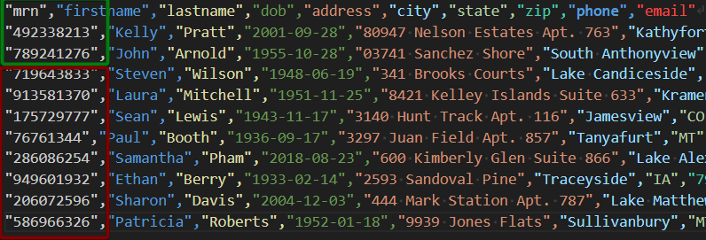
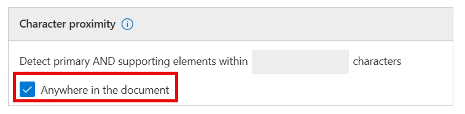
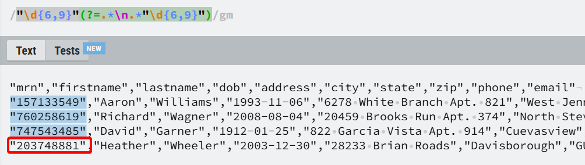
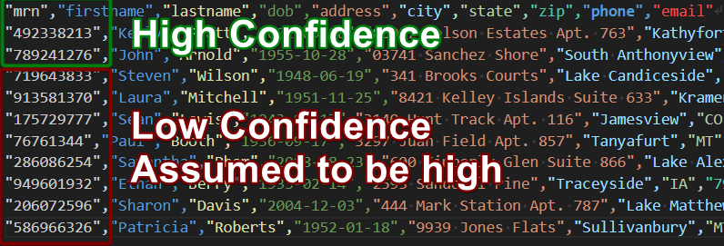
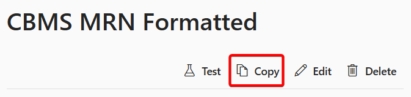
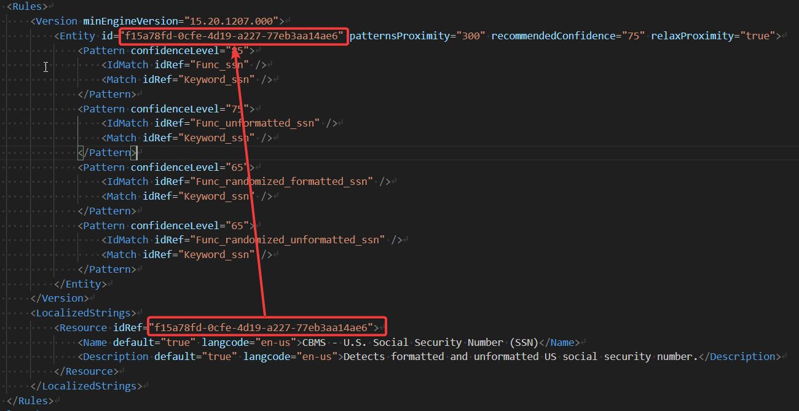

## Proximity
With Sensitive Information Types in Purview, the supporting elements typically are set to be within 300 characters of the match. This works well for text documents and emails, but is less effective for table-based data like spreadsheets or csv files.

For example, let's take a fictitious Medical Record Number. This example is a variable length number with no other formatting, and no padding. This is fairly common, especially with mixed MRN systems.

127528819: 6-9 digits

The corresponding regex to find this MRN is this:
``` regex
\b\d{6,9}\b
```

The custom SIT definition looks like this:

**Pattern #1**
- Confidence: High
- Regular Expression: `\b\d{6,9}\b`
- Character proximity: 300 characters (default)
- Supporting elements: case insensitive keywords
	- MRN, Medical Record Number, Record Number

**Pattern #2**
- Confidence: Low
- Regular Expression: `\b\d{6,9}\b`
- Character proximity: 300 characters (default)
- Supporting elements: none

**Test Data**
Our test data is a simple, fake extract from a MRN system. Note that MRN is the first column, and the column name is one of our keywords (mrn).

``` csv
"mrn","firstname","lastname","dob","address","city","state","zip","phone","email"
"492338213","Kelly","Pratt","2001-09-28","80947 Nelson Estates Apt. 763","Kathyfort","HI","66442","+1-578-586-3745x48021","wking@example.com"
"789241276","John","Arnold","1955-10-28","03741 Sanchez Shore","South Anthonyview","MN","56561","+1-988-725-1788x1975","michael33@example.org"
"719643833","Steven","Wilson","1948-06-19","341 Brooks Courts","Lake Candiceside","ND","92691","001-933-368-7396x72128","yclark@example.net"
"913581370","Laura","Mitchell","1951-11-25","8421 Kelley Islands Suite 633","Kramerfort","NM","30252","760.462.3509x7056","shawn66@example.org"
"175729777","Sean","Lewis","1943-11-17","3140 Hunt Track Apt. 116","Jamesview","CO","86702","001-964-653-2716x1838","aliciawilson@example.net"
"76761344","Paul","Booth","1936-09-17","3297 Juan Field Apt. 857","Tanyafurt","MT","80739","358.612.7934x4561","victoriawilson@example.com"
"286086254","Samantha","Pham","2018-08-23","600 Kimberly Glen Suite 866","Lake Alexanderville","NE","64307","350-511-9743x968","michael35@example.net"
"949601932","Ethan","Berry","1933-02-14","2593 Sandoval Pine","Traceyside","IA","79382","+1-682-236-0383x226","natasha45@example.org"
"206072596","Sharon","Davis","2004-12-03","444 Mark Station Apt. 787","Lake Matthewville","GU","87599","482.353.2044x885","christine42@example.com"
"586966326","Patricia","Roberts","1952-01-18","9939 Jones Flats","Sullivanbury","MT","41356","969-900-3288x749","silvaronald@example.com"
```

**Testing the SIT**
Running this test data though the tester on the SIT definition, and you'll get something along the lines of this:

Low - 10 unique matches

|Matches   |Supporting Elements |
| --------- | ------------------- |
| 206072596 | -                   |
| 286086254 | -                   |
| 492338213 | "mrn"               |
| 789241276 | "mrn"               |
| 76761344  | -                   |
| 949601932 | -                   |
| 719643833 | -                   |
| 175729777 | -                   |
| 913581370 | -                   |
| 586966326 | -                   |


High - 2 unique matches

|Matches   |Supporting Elements |
| --------- | ------------------- |
| 492338213 | "mrn"               |
| 789241276 | "mrn"               |

So why did the high only match two? Proximity. Think of CSVs as long run-on sentences. In our test data data above, 300 characters from "mrn" in the first line is around the middle of the third line. In our test data, MRNs that would match are highlighted in green, and those that are 300+ characters away from `mrn` in the first row won't match because of the distance between the actual MRN and the keyword mrn.




## Techniques
There are multiple ways to deal with this issue.

### Keyword removal

Creating a custom SIT based on a existing SIT, then removing the keyword requirements is one way to address the proximity requirements. The downside to this is an increase in false positives, especially in something like our MRN, where it's just nine digit number.

### Increasing proximity

You can increase the proximity value, or select anywhere in the document. This can work, however, this does increase the false positive rate, and also increases the chance of the DCS scan timing out in larger documents.



### Adding a lookahead
Instead of the regex matching just one instance, incorporate positive lookahead into the MRN regex that looks for another instance of a MRN on the next line.

``` regex
"\d{6,9}"(?=.*\n.*"\d{6,9}")
```

This will, however, miss the last MRN, as it doesn't have a MRN following it on the next line.


### Relaxing proximity

This technique, featured on the [Compliance CxE site](https://microsoft.github.io/ComplianceCxE/), creates an custom SIT with settings that will increase matches by assuming that low confidence matches without keywords will be counted as high confidence as long as there are high confidence matches as well of the same type. This works well for table based data, where it's generally safe to assume that the column contains data that matches.

In our example from above, our green MRNs are high, and the red MRNs will also be assumed to be high.



#### Creating a Relaxed Proximity SIT

1. We'll make a copy of our MRN sit in the UI.

    
2. Edit the copied sit.
3. Connect to the Compliance PowerShell.
    ``` Powershell
    Connect-IPPSession
    ```
4. Export the Custom Rule Pack to xml. The rule pack containing any duplicated base SITs is always called Microsoft.SCCManaged.CustomRulePack, so the export command would be this:
    ``` Powershell
    $rulepack = Get-DlpSensitiveInformationTypeRulePackage -Identity "Microsoft.SCCManaged.CustomRulePack"
    [System.IO.File]::WriteAllBytes('purview_custom_rulepack.xml', $rulepack.SerializedClassificationRuleCollection)
    ```
5. Edit the XML in an editor such as VS Code
6. Locate the rules element for the SIT you created earlier. Actual definitions are abstracted from the local-specific descriptions, so look in the ```<LocalizedStrings>``` find the names for the SITs and their matching guid.  
7. Change relaxProximity from false to true and save.
    ``` xml
    <Entity id="f15a78fd-0cfe-4d19-a227-77eb3aa14ae6" patternsProximity="300" recommendedConfidence="75" relaxProximity="true">
    ```
8. Upload the rulepack:
    ``` powershell
    Set-DlpSensitiveInformationTypeRulePackage -FileData ([System.IO.File]::ReadAllBytes(".\purview_custom_rulepack.xml"))
    ```
    Answer Yes when prompted.

After uploading, go back to the portal and test the SIT again with the same data as before. You'll notice that the matches that previously were lower confidence are included in the high, even though they do not have the `mrn` keyword within 300 characters.